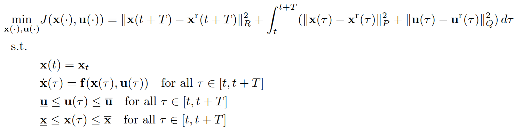
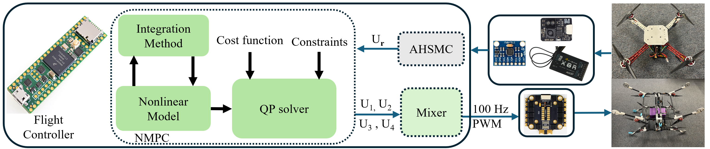
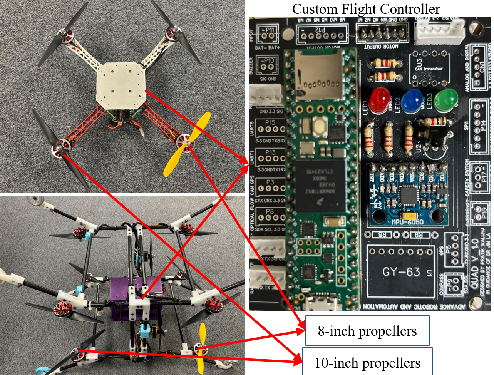

# SM-NMPC: Sliding Mode-Based Nonlinear Model Predictive Control for UAVs under Motor Failure on Microcontrollers
# Problem formulation
We are considering the NMPC with the following formulation:


With the reference as the input and the virtual control law proposed by the AHSMC, more details about the sub-controller can be found in the following manuscript:
[SM_NMPC_RA_L.pdf](https://github.com/user-attachments/files/19696574/SM_NMPC_RA_L.pdf)

# Code Generation
The code generation is based on ACADO code generation and the qpOASES solver; therefore, the following libraries are required:
- ACADO Toolkit (https://acado.github.io/)
- qpOASES (https://github.com/coin-or/qpOASES)

In order to generate the code of the NMPC for the Quadrotor UAVs, follow these commands:
```shell
# Step 1: Clone the repository and download the ACADO code generation folder
$ Download the acadogenquad folder from the main branch.

# Step 2: Navigate to the ACADO workspace and generate the code
$ cd acadogenquad/build
$ cmake ..
$ make

# Step 3: Run the code generation
$ cd ./acadogenquad
```

In order to generate the code of the NMPC for the Cube-Drone, follow these commands:
```shell
# Step 1: Clone the repository and download the ACADO code generation folder
$ Download the acadogencube folder from the main branch.

# Step 2: Navigate to the ACADO workspace and generate the code
$ cd acadogencube/build
$ cmake ..
$ make

# Step 3: Run the code generation
$ cd ./acadogencube
```

Now, the generated code is located in the acadogen_quad or the cube_gen folder, which includes the necessary include directory required to run the NMPC. For more details on code generation, the author strongly recommends visiting: [ACADO Getting Started Guide](https://docs.ros.org/en/kinetic/api/acado/html/sim_getting_started.html)

# Simulation

## Software Requirements & Setup

The simulation is configured with the following setup:
- Ubuntu 22.04
- ROS2 Humble
- Gazebo 11
- Xarco-ROS-Humble (sudo apt install ros-humble-xacro)
- Gazebo_ros_pkgs (sudo apt install ros-humble-gazebo-ros-pkgs)
- ACADO Toolkit (https://acado.github.io/)


Follow these commands in order to install the simulation of SM-NMPC for the UAVs on ROS 2:

```shell
# Step 1: Create and build a colcon workspace:
$ mkdir -p ~/dev_ws/src
$ cd ~/dev_ws/
$ colcon build
$ echo "source ~/dev_ws/devel/setup.bash" >> ~/.bashrc

# Step 2: Clone this repo into your workspace
$ cd ~/dev_ws/src
Download the folder smcmpcquad or the smcnmpccube in the main branch

# Step 3: Build the colcon workspace for this package
$ cd ~/dev_ws
$ colcon build
```
* Note that the package contains the code generation and includes the qpOASES library. If the user wants to use SM-NMPC for a different problem, they need to regenerate the code and replace it to the include folder.
* Note that this project uses a custom plugin. Users need to replace the plugin path in the file /urdf/uav_drone.urdf.xacro at line 268. Replace: plugin name="uavplugin" filename="/home/vanchung/dev_ws/install/smcmpcquad/lib/smcmpcquad/libuavplugin.so" with the correct path by changing the username to the name of your computer. For the Cube-Drone, Replace line 1009 in the file /urdf/cube.urdf.xacro: plugin name="cubeplugin" filename="/home/vanchung/dev_ws/install/smcnmpccube/lib/smcnmpccube/libcubeplugin.so" with the correct path by changing the username to the name of your computer. Then rebuild the project again to run the simulation.

## Simulation results

To run the SM-NMPC for Quadrotor UAVs simulation, follow these commands:

```shell
# Step 1: Run the Gazebo model:
$ ros2 launch smcmpcquad model.launch.py

# Step 2: Run the EKF & controller
$ ros2 run smcmpcquad EKF node
$ ros2 run smcmpcquad smcmpcquad
```
To run the SM-NMPC for Cube-Drone simulation, follow these commands:

```shell
# Step 1: Run the Gazebo model:
$ ros2 launch smcnmpccube model.launch.py

# Step 2: Run the controller
$ ros2 run smcnmpccube smcnmpccube
```
## Motor failure results

To run the motor failure scenario, the user needs to modify the plugin in the file /src/uavplugin.cc or /src/cubeplugin.cc. Change the added throttle to 50% as described in the manuscript. For the quadrotor UAVs, comment out line 135 and uncomment line 132. For the Cube, comment out line 176 and uncomment line 178.

Then rebuild the project and run the simulation as in the normal cases described above.

# Experiments
## Hardware Setups
We used the following sensors and receivers for the quadrotors:
- Teensy 4.1 
- MPU 6050
- Micoair MTF-02P optical flow and LiDAR sensor
- FrSky X8R radio receiver

## Embedded library
To embed the controller onto the Teensy 4.1, the user must download the ArduinoSMNMPC folder. This folder contains the library for NMPC (Nonlinear Model Predictive Control) and the implemented code for the quadrotor. The user must copy the code generation library into the libraries folder of the Arduino IDE and then upload the sketch nmpcpidteensy.ino to the Teensy 4.1. As discussed earlier, if the user wants to run their own NMPC controller for another system, they must generate the code according to the specific problem and then replace all the generated files in the library to update the embedded code. (Note that qpOASES is already included in the library.)

* Note: The embedded code may have some missing includes in the acado_qpoases_interface.cpp file. To fix this, change #include "INCLUDE/EXTRAS/SolutionAnalysis.hpp" to #include "SolutionAnalysis.hpp" and change #include "INCLUDE/QProblemB.hpp" to #include "QProblemB.hpp".
  
## Results
We verified the efficiency of our control method for real-time execution on the resource-constrained Teensy 4.1 microcontroller and implemented our flight controller on both the quadrotor UAVs and the Cube-Drone for normal and motor failure cases. 

The scheme of the proposed method is as follows: 
<p align="center">
  
</p>

We also test the stability of the proposed on the motor failure cases:
<p align="center">
  
</p>

The video results:


https://github.com/user-attachments/assets/df3c5e3f-bae2-4db5-833c-5699be735a65


# Contact
- [Van Chung Nguyen](mailto:vanchungn@.unr.edu)
- [Hung La](mailto:hla@unr.edu)
